# LOTR Filming Locations

[Visit website here](https://alexelbert.github.io/lotr-sites/)

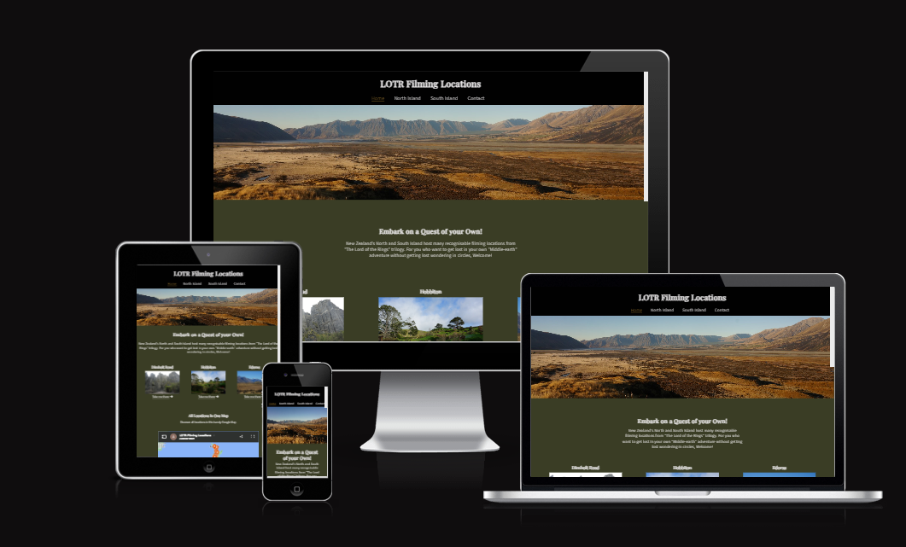

Created to easily provide LOTR filming locations with links to maps and coordinates. Information that people travelling New Zealand specifically would come to appreciate. This website was made for educational purposes only.

Website is made up of following sections:

The business goals for the website are:

1. Make location information gathered and easy to access.
2. Inspire others that has an interest for LOTR fans.
3. Earn commission by commercial our tourist purposes, links and references for example.

User goals for this website are:

1. As a first-time visitor, I want to easily find useful information about LOTR film locations.
2. As a first-time visitor, I want to have access to many locations a few clicks away.
4. As a recurring or first-time visitor, I want compiled source information about locations.
5. As a recurring or first-time visitor. I want to be able to contact the author about updates or general feedback.

## UX

### Strategy

Taking into consideration the core UX principles made me first think of who my target audience is and what features and technologies to implement.

LOTR Filming Locations target users are:

- Age, 18-60
- Has an interest in the LOTR trilogy
- Interested in having something unique to visit while travelling in New Zealand

What these users would be looking for:

- Clear and easily compiled information
- Photos that would incite an interest in actually going there
- Helpful information on how to get there

This website offers all of this, together with an comfortably user experience through links and a clear cut navigation. The information is kept to a minimum to not overwhelm the user.
Since most of the visitors will be travelling the use of mobile device is assumed. Because of this fact the website is made responsive on different screen sizes.

### Scope

The following features will be included in the release to achieve the user and business goals:

- Header and Navigation bar that follows on screen at all times, to navigate the different pages
- Quick introduction with connected links to the correlating sections
- Complete map of new Zealand with all locations marked
- Every locations actual coordinates to be able to copy or just press to be led to the location on google maps
- Links to general information and advice for travelling New Zealand
- Pictures of the locations to have an idea of what to expect when you get to the location
- Links to affiliate social-networking sites
- Contact page to share your thoughts or if you have an addition to contribute

### Structure

This is a multiple page website to allow for quick and easy navigation using the navigation bar that is remaining on screen while scrolling. I made the following choice for information flow 'Home > North Island > South Island > Contact', for making an easy and clear cut decision as a user depending on where you are located. The information is minimal in conjunction with a simple short information text and two clicks away from having the location in your available gps unit. The bottom of the page you have useful links to other websites that can facilitate most of your other needs, access, cost of entry among more. Finally there is a contact page when you as a user can share your thoughts and input that will be useful for further updates for LOTR Filming Locations.

### Skeleton

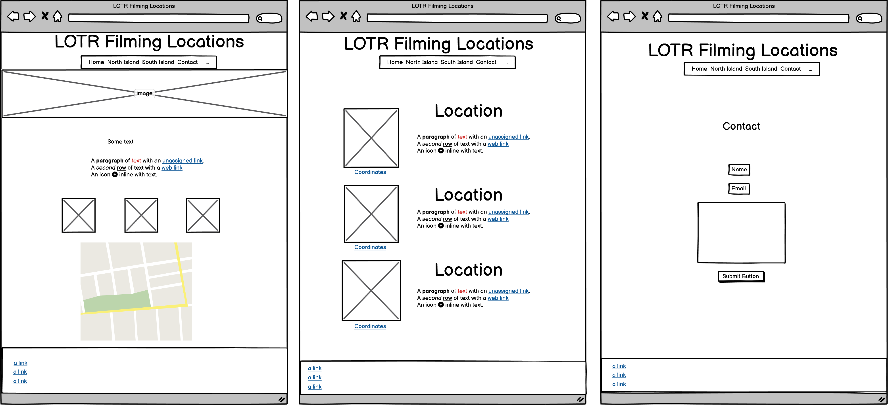

The layout for the north and south island is the same. The website is slightly different from these original wireframes. In the final version I made some changes to the Image section on the 'Home' page included headings and links that take yuo directly to the correlating content. Made an addition of icon links to Github and Linkedin in the footer.

### Surface

The choice for the colour palette is based around different colours that originates from LOTR in different ways. The black and white originated from the style on the most recent releases of the books.
The green and gold was inspired from the movies, to be more precise, the green cloaks the fellowship is wearing and the gold from the one ring. These different colours is presented in a way to make the text and background content to contrast each other for ease of visible use.

I used Google fonts, 'Playfair Display' for the headings and 'Source Sans 3' for all the other text. I ultimately choose these fonts since it looked similar to the fonts that are used for the LOTR books.

## Features

This website is fully responsive across all screens, with an origin point from a mobile perspective. The content is divided up onto four pages represented in the navigation bar. Navigation, footer, background colour and the text colour stay the same across all pages for a consistent design of the website.

### Navbar

The navigation bar is placed on a black background with an off-white text. Highlighted with colour a clear line to indicate where you are currently located across the pages. Hover effect of a colour shift is added to the other options to clearly indicate that it is a link option using the same colour scheme for cohesiveness.

### Home

On this page you get introduced to the website.
The first section is portrayed with a beautiful background image to draw the users attention with a following H2 and p element giving you a brief introduction of what is to be expected. Underneath there is a following section referred as 'index-pictures' where the user is introduced to 3 different locations to draw you in, using an H3 element followed by a p element containing a link to take you to the correlating segment. This section is presented in a vertical manner on mobile devices and horizontal on all larger screens. Lastly you the user is presented to a linked map where you can get a full picture of New Zealand and where all locations are located so as a user you can get a full overview.

### North Island and South Island

This page is made up of a single section containing a main div which contains another div with two child divs, first one containing an img followed by a p/action element with the correlating coordinates with a golden hover effect. Second div containing an H3 followed by a P element describing the portrayed img in the previous div. The same code follows six times over across the page making up it's content. Displayed vertically on mobile devices and in a grid on all larger screens. Image to the left, description on the right.

### Contact

The Contact page is made up of one section element containing a div with an H2 and P element describing what's expected on this page. following this div is a form element asking the user for name and email using the text and email input that has a required attribute with clear labels in front of the text boxes. A textarea element with a placeholder text for the user to type their message, under the textarea a clear indicated submit input named 'send' with a golden hover effect. This page is portrayed on the same green background used throughout the website with all text in an off white color.

### Footer

Footer section in the same across all pages and has the same black and off white color scheme as the navbar. It's made up of a section containing two div elements. One of them contains an unordered list with three links to other useful websites styled to appear as normal text following an icon which indicates to the user that is is a link, same gold colour applies when hovering the link. Second div contains an H5 element and another div containing two action attributes that appears in the form of icons.

## Technologies Used

The following technologies has been used to make this website work:

- [HTML](https://developer.mozilla.org/en-US/docs/Web/HTML)
    - Basic building block and structure of the content used for the project.
- [CSS](https://developer.mozilla.org/en-US/docs/Learn/Getting_started_with_the_web/CSS_basics)
    - Used for styling all the content of the website.
- [Font Awesome](https://fontawesome.com/)
    - Used to acquire icons used for links and social networking.
- [Google Fonts](https://fonts.google.com/)
    - Used to obtain the fonts used across the website.
- [Dev.Opera](https://dev.opera.com/extensions/dev-tools/)
    - Used as a method of testing responsiveness and other issues/bugs with spacing and bugs.
- [GitHub](https://github.com/)
    - Used for storing pushed code.
- [Git](https://git-scm.com/)
    - Used to track changes in the code through  terminal commits and pushing from VS Code to GitHub. 
- [Visual Studio Code](https://code.visualstudio.com)
    - Used as a code editor.
- [Balsamiq](https://balsamiq.com/)
    - Used for creating wireframes to the project.
- [Code Spell Checker](https://marketplace.visualstudio.com/items?itemName=streetsidesoftware.code-spell-checker)
    - Extension software used to fix spelling errors across the project.
- [W3C Markup Validation Service](https://validator.w3.org)
    - Used to validate HTML code.
- [W3C CSS Validation Service](https://jigsaw.w3.org/css-validator/)
    - Used to validate CSS code.
- [Am I Responsive](http://ami.responsivedesign.is/)
    - Used to make responsive image for README.md file.
- [PageSpeed Insigts](https://pagespeed.web.dev)
    - Used to assess performance of the website.
- [Google My Maps](https://mymaps.google.com)
    - Used for making a shared map with marked locations for the website.

## Testing

### User Stories
1. **As a first-time visitor, I want to easily find useful information about LOTR film locations.**
As soon as the page opens you can find clear information from the name of the website and North and South island pages that will take you directly there.

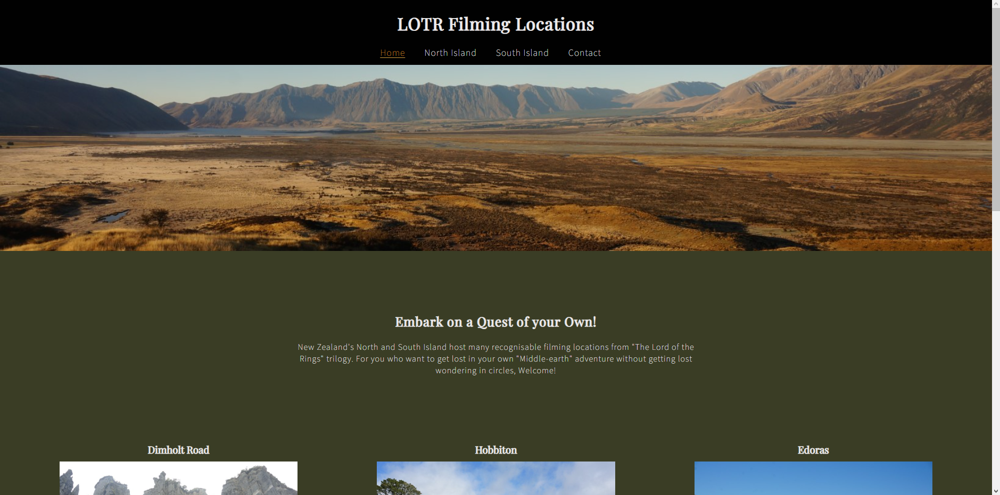

2. **As a first-time visitor, I want to have access to many locations a few clicks away.**
After just one click you can find multiple locations with provided pictures, short information text and links to precise location on google maps. You can find all locations marked up with just one click away after just scrolling on the home page also.

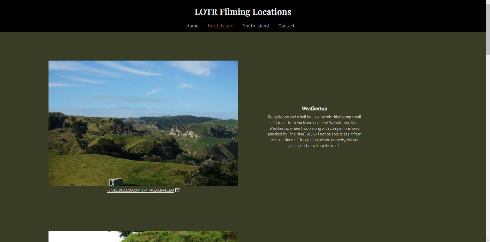
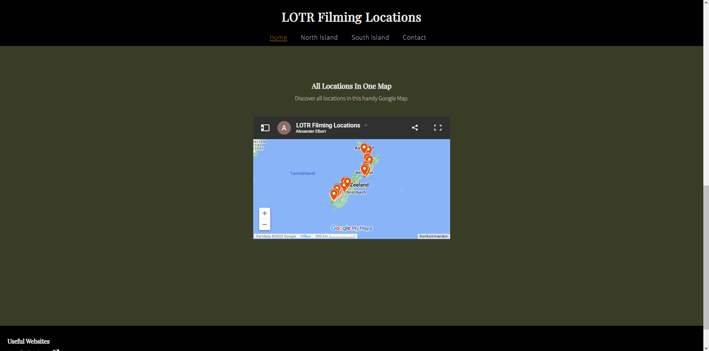

4. **As a recurring or first-time visitor, I want compiled source information about locations.**
On either the north or south island page you can find compiled information and pictures with links that opens in new browser windows so you will not have to revert back to the website for ease of use.

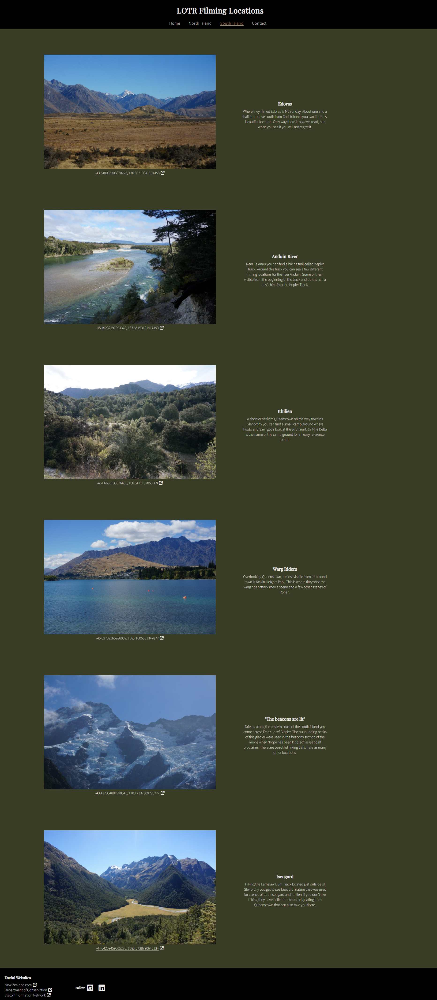

5. **As a recurring or first-time visitor. I want to be able to contact the author about updates or general feedback.**
In the navigation that follows as you scroll the pages you can find 'Contact' that will take you to a form you can fill out to give your input about the website.

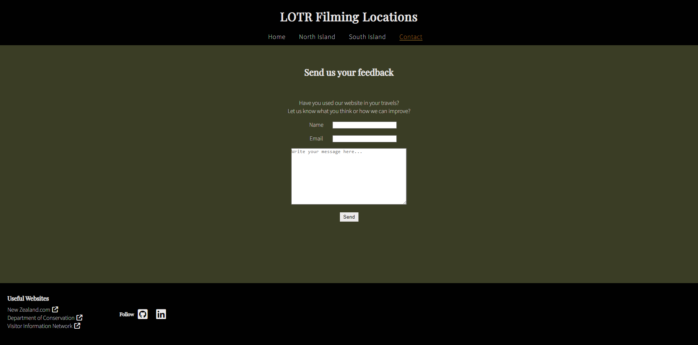

## PageSpeed Insights

I used PageSpeed Insights to assess my website performance. First run i got a performance score of 60 due to large image sizes. After resizing the pictures i was able to get the performance score up.

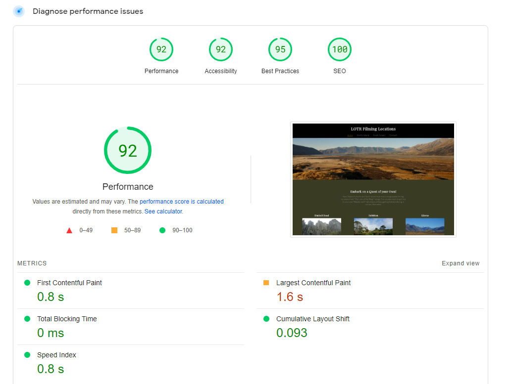

## HTML and CSS Validation

I checked my code against validators at several point throughout the project. Managed to not get a lot of warnings and errors. Had a few stray tag ends on the HTML i had to fix. In the CSS i have a warning as i turn in the project, since i don't have a database to submit to i made it so that when you are submitting your information you are reverted to a thank-you.html form.

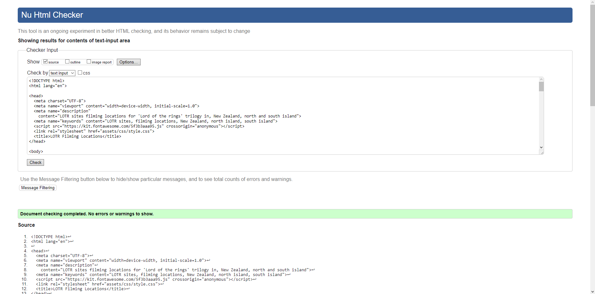
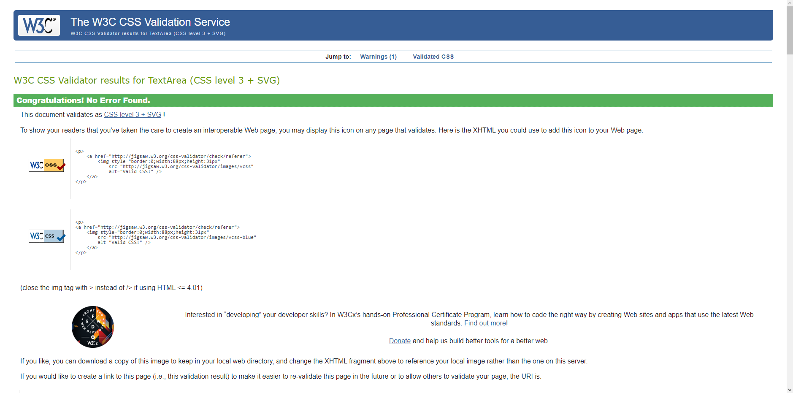

## Known bugs and fixes

While testing all links on the website I noticed that when you opened the map on the home page i had used my personal account which resulted in an error when opened from another user then me. I fixed this problem by using 'Google My Maps'
where i was able to share with anyone where the result will look as following:

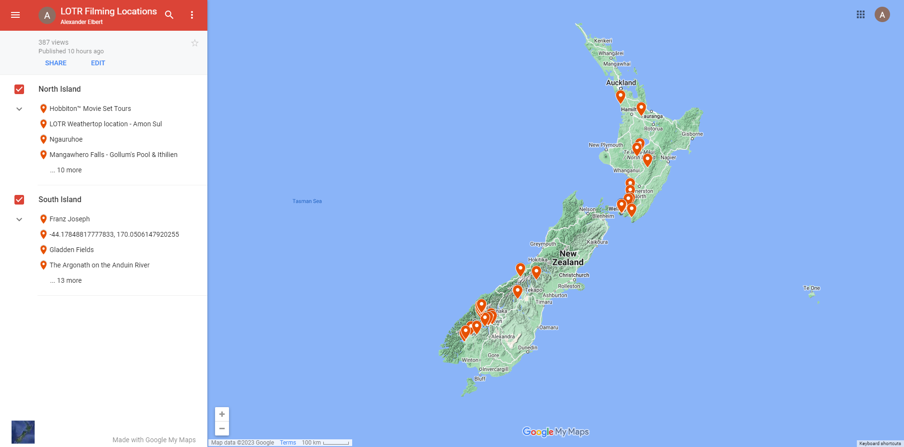

## Deployment

I deployed this website about half way into the project using GitHub with these following steps:

*Page deployment*

1. Log in to Github
2. In my repositories, select the project you wish to deploy
3. In the menu at the top of the screen, click on 'Settings'
4. Click on 'Pages' on the menu on the left side of the screen
5. In the 'Branch' section and select 'main' and click on 'Save'
6. Now your page has been given a URL which is displayed at the top of your Github Pages 

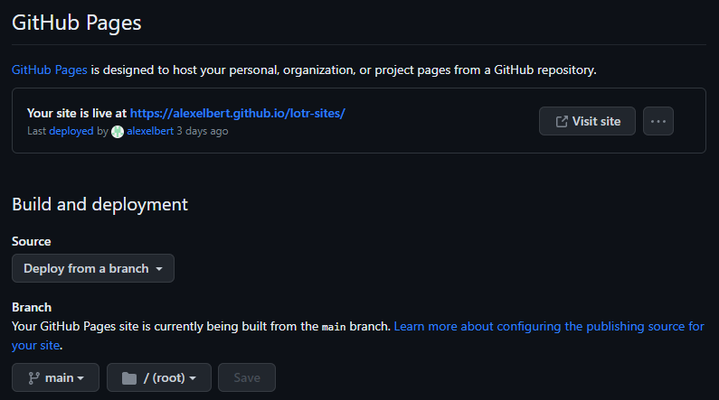

## Credits

Producing this website i have used several resources for inspiration and researched for help.

The following websites was used for inspiration and research:
- [Visit Sweden](https://visitsweden.com)
- [Love Running project (code institute)](https://alexelbert.github.io/love-running/)

Used code from these resources, credited as comments code:

- [Mozilla Developer](https://developer.mozilla.org/en-US/docs/Web/CSS/CSS_grid_layout/Basic_concepts_of_grid_layout)

- [CSS-Tricks](https://css-tricks.com/almanac/properties/s/scroll-margin/)
- [Mozilla Developer](https://developer.mozilla.org/en-US/docs/Web/CSS/:hover)

Other websites i used for the content:

- Most content i wrote myself but used [Google Maps](https://maps.google.com
) to reference driving distances and [Wikipedia](https://www.wikipedia.org) to check that my memory served me right for specific location information.

## Acknowledgements

I want to thank my mentor Harry Dhillon for giving support through the project and my girlfriend Sabrina Fonseca Pereira for her support and feedback.

 